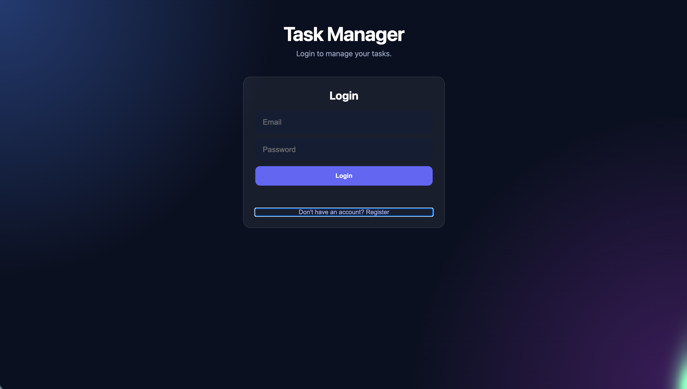
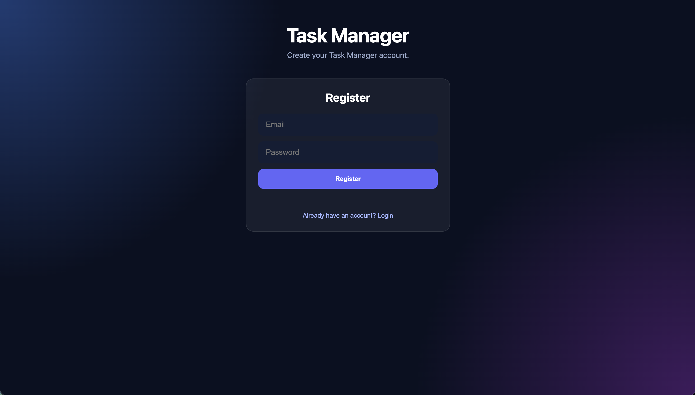

Got it — you want the **whole README as one medium-sized copy-paste text block**, not a shortened version.
# 🚀 Task Manager API

A full-stack task management application built with **FastAPI, PostgreSQL, SQLAlchemy, Pydantic, HTML, CSS, and JavaScript**.

The project was originally built with Flask + SQLite and later upgraded to FastAPI + PostgreSQL.

## 🌐 Live Demo

**Live API:**  
https://task-manager-api-1-xy2g.onrender.com

**Swagger Docs:**  
https://task-manager-api-1-xy2g.onrender.com/docs

## ✨ Features

- User registration
- User login
- JWT authentication
- Protected task routes
- Create tasks
- View tasks
- Update tasks
- Complete tasks
- Delete tasks
- PostgreSQL database
- SQLAlchemy ORM
- Pydantic validation
- CORS support
- Responsive frontend
- Cloud deployment

## 🛠️ Tech Stack

**Backend:** Python, FastAPI, SQLAlchemy, Pydantic, PostgreSQL, JWT, Passlib, bcrypt

**Frontend:** HTML, CSS, JavaScript

**Deployment:** GitHub, Render

## 🏗️ Architecture

Frontend
   ↓
Login / Register
   ↓
JWT Authentication
   ↓
FastAPI
   ↓
Protected CRUD
   ↓
SQLAlchemy
   ↓
PostgreSQL

## 📁 Project Structure

task-manager-api/

├── backend/
│   ├── main.py
│   ├── database.py
│   ├── models.py
│   ├── schemas.py
│   ├── curd.py
│   └── init_db.py
│
├── frontend/
│   └── index.html
│
├── screenshots/
│   ├── frontend.png
│   ├── login.png
│   ├── register.png
│   └── swagger.png
│
├── .gitignore
├── Procfile
├── README.md
└── requirements.txt

> `.env` contains environment variables and is kept locally. It is not committed to GitHub.

## 🔌 API Endpoints

| Method | Endpoint      | Description                 |
| ------ | ------------- | --------------------------- |
| POST   | `/register`   | Register a new user         |
| POST   | `/login`      | Login and receive JWT token |
| GET    | `/`           | Get all tasks               |
| POST   | `/tasks`      | Create a task               |
| PUT    | `/tasks/{id}` | Update a task               |
| DELETE | `/tasks/{id}` | Delete a task               |

### Register

{
  "email": "example@gmail.com",
  "password": "your_password"
}

### Login

{
  "email": "example@gmail.com",
  "password": "your_password"
}

Successful login returns a JWT token which is required for protected task routes.

### Create Task

{
  "task": "Learn FastAPI"
}

### Update Task

{
  "task": "Learn FastAPI",
  "status": "Completed"
}

## 🔐 Authentication

The application uses **JWT authentication** to protect task management routes.

* Users can register and log in.
* Passwords are hashed using Passlib and bcrypt.
* Login generates a JWT token.
* The frontend stores the token and sends it with protected requests.
* FastAPI verifies the JWT before allowing access to protected routes.

Register
   ↓
Login
   ↓
JWT Token
   ↓
Authorization: Bearer <token>
   ↓
JWT Verification
   ↓
Protected Task API

## 🗄️ Database

The application uses **PostgreSQL** with **SQLAlchemy ORM**.

The database connection is provided through an environment variable:

DATABASE_URL=your_database_url

## 💻 Run Locally

Clone the repository:

git clone https://github.com/sabirahmed-dev/task-manager-api.git
cd task-manager-api

Install dependencies:

pip install -r requirements.txt

Run the API:

uvicorn backend.main:app --reload

Local API:

http://127.0.0.1:8000

Local Swagger:

http://127.0.0.1:8000/docs

## 📸 Screenshots

### Task Manager

### Login

### Register

### FastAPI Swagger

## 🔄 Project Upgrade

### Before

Flask + SQLite

### Now

FastAPI + PostgreSQL + SQLAlchemy + Pydantic + JWT Authentication

## 👨‍💻 Author

**Sabir Ahmed**

BCA Student | Backend Developer

