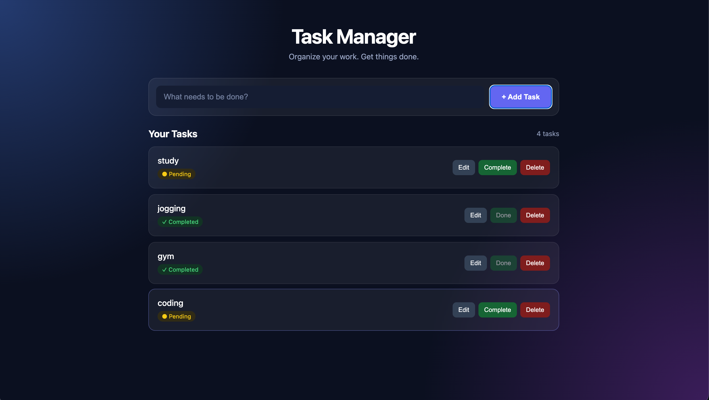
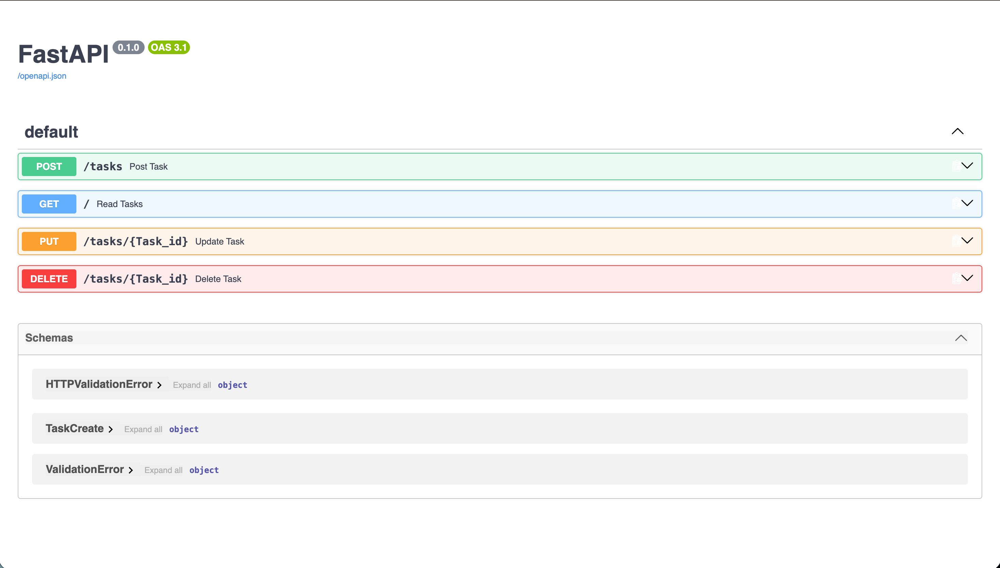

# 🚀 Task Manager API

A full-stack task management application built with **FastAPI, PostgreSQL, SQLAlchemy, Pydantic, HTML, CSS, and JavaScript**.

The project was originally built with Flask + SQLite and later upgraded to FastAPI + PostgreSQL.

## 🌐 Live Demo

**Live API:**  
https://task-manager-api-1-xy2g.onrender.com

**Swagger Docs:**  
https://task-manager-api-1-xy2g.onrender.com/docs

## ✨ Features

- Create tasks
- View tasks
- Update tasks
- Complete tasks
- Delete tasks
- PostgreSQL database
- SQLAlchemy ORM
- Pydantic validation
- CORS support
- Responsive frontend
- Cloud deployment

## 🛠️ Tech Stack

**Backend:** Python, FastAPI, SQLAlchemy, Pydantic, PostgreSQL

**Frontend:** HTML, CSS, JavaScript

**Deployment:** GitHub, Render

## 🏗️ Architecture

```text
Frontend
   ↓
FastAPI
   ↓
CRUD
   ↓
SQLAlchemy
   ↓
PostgreSQL
```

## 📁 Project Structure

```text
task-manager-api/
│
├── backend/
│   ├── main.py
│   ├── database.py
│   ├── models.py
│   ├── schemas.py
│   ├── curd.py
│   └── init_db.py
│
├── frontend/
│   └── index.html
│
├── screenshots/
│   ├── frontend.png
│   └── swagger.png
│
├── .gitignore
├── Procfile
├── README.md
└── requirements.txt
```

> `.env` contains environment variables and is kept locally. It is not committed to GitHub.

## 🔌 API Endpoints

| Method | Endpoint | Description |
|--------|----------|-------------|
| GET | `/` | Get all tasks |
| POST | `/tasks` | Create a task |
| PUT | `/tasks/{id}` | Update a task |
| DELETE | `/tasks/{id}` | Delete a task |

### Create Task

```json
{
  "task": "Learn FastAPI"
}
```

### Update Task

```json
{
  "task": "Learn FastAPI",
  "status": "Completed"
}
```

## 🗄️ Database

The application uses **PostgreSQL** with **SQLAlchemy ORM**.

The database connection is provided through an environment variable:

```env
DATABASE_URL=your_database_url
```

## 💻 Run Locally

Clone the repository:

```bash
git clone https://github.com/sabirahmed-dev/task-manager-api.git
cd task-manager-api
```

Install dependencies:

```bash
pip install -r requirements.txt
```

Run the API:

```bash
uvicorn backend.main:app --reload
```

Local API:

```text
http://127.0.0.1:8000
```

Local Swagger:

```text
http://127.0.0.1:8000/docs
```

## 📸 Screenshots

### Task Manager



### FastAPI Swagger



## 🔄 Project Upgrade

### Before

```text
Flask + SQLite
```

### Now

```text
FastAPI + PostgreSQL + SQLAlchemy + Pydantic
```

## 👨‍💻 Author

**Sabir Ahmed**

BCA Student | Backend Developer


