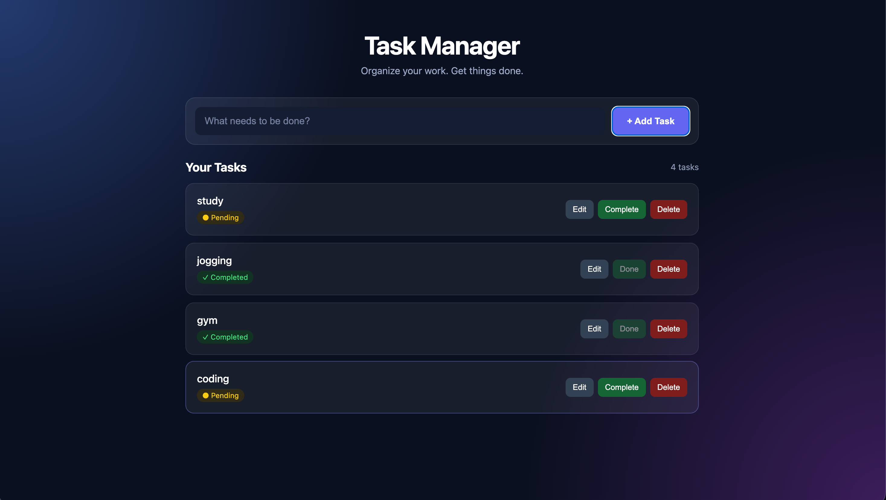
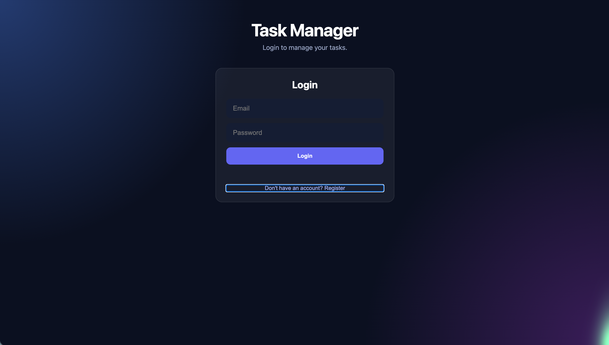
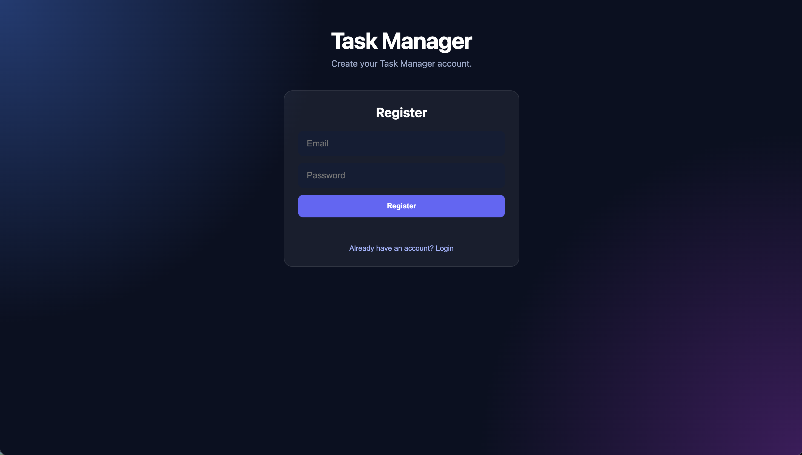
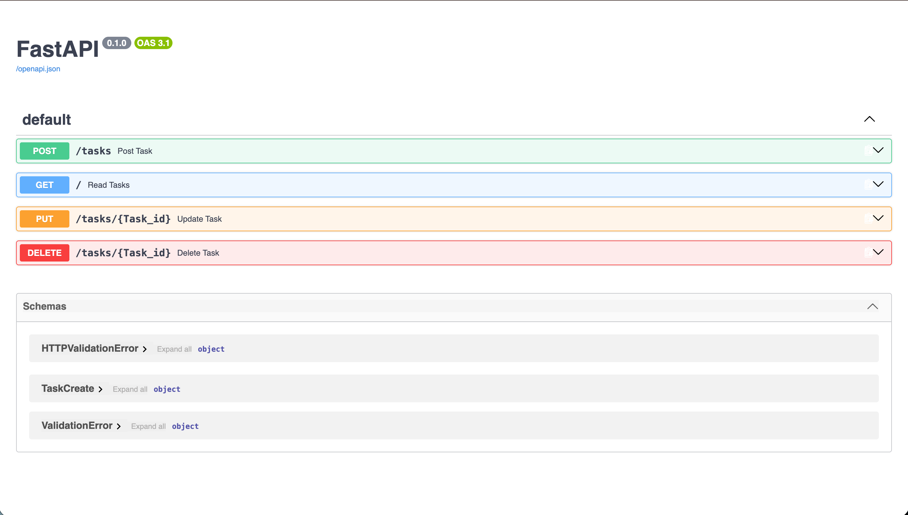

# 🚀 Task Manager API

A full-stack task management application built with **FastAPI, PostgreSQL, SQLAlchemy, Pydantic, HTML, CSS, and JavaScript**.

Originally built with **Flask + SQLite**, then upgraded to **FastAPI, PostgreSQL, JWT authentication, logging, and Docker**.

## 🌐 Live Demo

**API:**
https://task-manager-api-1-xy2g.onrender.com

**Swagger:**
https://task-manager-api-1-xy2g.onrender.com/docs

## ✨ Features

- User registration and login
- JWT authentication
- Protected task CRUD operations
- Password hashing with Passlib and bcrypt
- PostgreSQL + SQLAlchemy ORM
- Pydantic validation
- Error handling and logging
- Environment variables
- Docker and Docker Compose
- Responsive frontend
- Render deployment

## 🛠️ Tech Stack

**Backend:** Python, FastAPI, SQLAlchemy, PostgreSQL, Pydantic, JWT

**Frontend:** HTML, CSS, JavaScript

**DevOps:** Docker, Docker Compose

**Deployment:** GitHub, Render

## 🏗️ Architecture

```text
Frontend
   ↓
JWT Authentication
   ↓
FastAPI
   ↓
SQLAlchemy
   ↓
PostgreSQL
````

### Docker Compose

```text
FastAPI Container
       ↓
Docker Network
       ↓
PostgreSQL Container
       ↓
Persistent Volume
```

## 🔌 API Endpoints

| Method | Endpoint      | Description           |
| ------ | ------------- | --------------------- |
| POST   | `/register`   | Register user         |
| POST   | `/login`      | Login and receive JWT |
| GET    | `/`           | Get tasks             |
| POST   | `/tasks`      | Create task           |
| PUT    | `/tasks/{id}` | Update task           |
| DELETE | `/tasks/{id}` | Delete task           |

## 📸 Screenshots

### Task Manager



### Login



### Register



### Swagger



## 🐳 Run with Docker

```bash
docker compose up --build
```

API:

```text
http://localhost:8000
```

Swagger:

```text
http://localhost:8000/docs
```

`.env` contains local environment variables and secrets and is not committed to GitHub.

**## 📸 Screenshots**

**### Task Manager**

![Task Manager]\(screenshots/frontend.png)

**### Login**

![Login]\(screenshots/login.png)

**### Register**

![Register]\(screenshots/register.png)

**### FastAPI Swagger**

![FastAPI Swagger]\(screenshots/swagger.png)

## 🔄 Project Upgrade

**Before:** Flask + SQLite

**Now:** FastAPI + PostgreSQL + SQLAlchemy + Pydantic + JWT + Logging + Docker

## 👨‍💻 Author

**Sabir Ahmed**

BCA Student | Backend Developer


